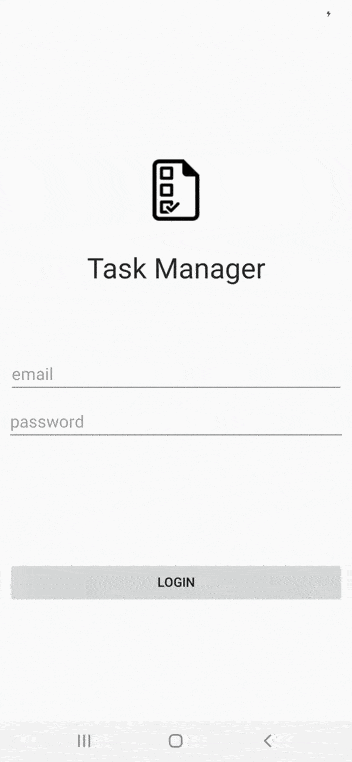

# 13. Android Local Storage & List Views

## Pruba de funcionamiento



## Back

3.2-android-secure-rest-api

```
http://localhost:8080
``` 

### Run

```
cd 3.2-android-secure-rest-api/secure-api-spring-boot
gradle bootRun
```

## Front 

3.3-android-local-storage-list-views

```
Cambiar IP de BASE_URL en co.edu.eci.ieti.android.network.RetrofitNetwork
``` 


### Run

```
Android studio
```

### Credentials

```
email: test@mail.com
password: prueba
```

## Código de honor

La presencia de este documento en este repositorio es un compromiso explícito de los colaboradores de seguir el siguiente código de honor:

Código de Honor
------
Debes seguir el Código de honor del ingeniero de sistemas para defender el estándar de integridad académica de la ECI:

- Tus respuestas a tareas, cuestionarios y exámenes deben ser tu propio trabajo (excepto para las tareas que permiten explícitamente la colaboración).

- No puedes compartir tus soluciones de tareas, cuestionarios o exámenes con otra persona a menos que el instructor lo permita explícitamente. Esto incluye cualquier cosa escrita por ti, como también cualquier solución oficial proporcionada por el docente o el monitor del curso.

- No puedes participar en otras actividades que mejorarán de manera deshonesta tus resultados o que mejorarán de manera deshonesta o dañarán los resultados de otras personas.
